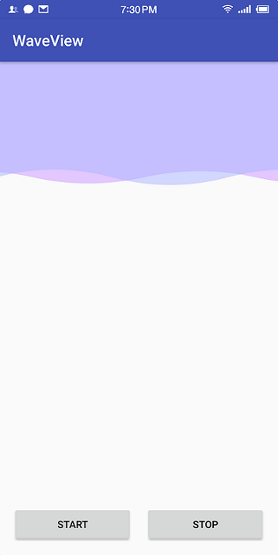

## WaveView
### 简介
少啰嗦，看东西  
  
WaveView 是一个可以高度自定义的波浪控件，能绘制出自己想要的曲线波浪
- 支持设置一个或两个波浪
- 支持分别设置波浪的振幅、波长、水位线高度、初始偏移量
- 支持分别设置移动一个波长的时间，支持开启和暂停动画
- 支持设置移动方向（左、右）
- 支持设置波浪位置（顶部、底部）
- 支持两种绘制方式（贝塞尔曲线和三角函数曲线）

### 用法
#### 1. 在 project 的 build.gradle 添加以下代码
```gradle
allprojects {
	repositories {
		...
		maven { url 'https://www.jitpack.io' }
	}
}
```
#### 2. 在 app 的 build.gradle 添加依赖
```gradle
dependencies {
	implementation 'com.github.CaiShenglang:WaveView:1.0.2'
}
```
#### 3. 在 xml 添加 WaveView 
```xml
<com.caisl.waveview.WaveView
        android:id="@+id/wave_view"
        android:layout_width="wrap_content"
        android:layout_height="wrap_content"
        app:cycleDuration="4000"
        app:cycleDuration2="5000"
        app:drawMode="bezier"
        app:moveDirection="left"
        app:startAnim="false"
        app:waterLevelHeight="150dp"
        app:waveAmplitude="10dp"
        app:waveAmplitude2="8dp"
        app:waveColor="#88afb8ff"
        app:waveColor2="#e2c8ff"
        app:waveLength="300dp"
        app:waveLengthPercent2="0.8"
        app:waveDefOffset="20dp"
        app:waveDefOffsetPercent2="0.3"
        app:waveCount="2"
        app:waveLocation="top" />
```
自定义属性说明  

自定义属性|类型|作用
---|:-:|---
startAnim|boolean|是否开启动画，默认开启
waveCount|integer|波浪数量，默认显示一个
waterLevelHeight|dimension|水位高度，默认是控件高度 - 最大振幅
waveColor|color|第一个波浪的颜色
waveColor2|color|第二个波浪的颜色
waveAmplitude|dimension|第一个波浪的振幅
waveAmplitude2|dimension|第二个波浪的振幅
waveLength|dimension|第一个波浪的波长，默认是控件宽度
waveLength2|dimension|第二个波浪的波长，默认是控件宽度
waveLengthPercent|float|第一个波浪占控件宽度的百分比
waveLengthPercent2|float|第二个波浪占控件宽度的百分比
waveDefOffset|dimension|第一个波浪的初始偏移量
waveDefOffset2|dimension|第二个波浪的初始偏移量
waveDefOffsetPercent|float|第一个波浪默认偏移量占波长的百分比
waveDefOffsetPercent2|float|第二个波浪默认偏移量占第二个波长的百分比
cycleDuration|integer|第一个波浪移动一个周期的时长
cycleDuration2|integer|第二个波浪移动一个周期的时长
moveDirection|left、right|移动方向，默认向右（向左、向右）
waveLocation|top、bottom|波浪位置，默认在底部（顶部、底部）
drawMode|bezier、sin、cos|绘制的模式，默认是贝塞尔曲线绘制（贝塞尔曲线、正弦曲线、余弦曲线）
#### 4. 如果需要动态设置开始或停止动画
```java
mWaveView = findViewById(R.id.wave_view);
mWaveView.startAnim(); // 开始或继续动画
mWaveView.stopAnim(); // 暂停动画
```
